# NYAYAVAULT — Detailed Project Explanation & Page-by-Page Screen Guide

> **SIH Problem Statement**: SIH26190 — Secure Digital Document Management System for Legal and Investigation Documents  
> **Sponsoring Agency**: National Crime Records Bureau (NCRB) / Ministry of Home Affairs  
> **Prototype Version**: Prototype 1.0  

---

## 📌 Executive Summary

**NYAYAVAULT** is a case-centric, role-governed digital document management platform engineered for law enforcement agencies, prosecution departments, forensic laboratories, and judicial courts. It addresses critical challenges in legal document management including document tampering, fragmented evidence, lack of auditability, and unauthorized access.

### Core Technical Pillars:
1. **Case-Centric Document Registry**: All FIRs, witness statements, forensic reports, and charge sheets are indexed under unified investigation case files.
2. **Cryptographic SHA-256 Fingerprinting**: Calculates a 256-bit hash live in the browser using the Web Crypto API (`crypto.subtle`) before file upload.
3. **Mock Blockchain Ledger Abstraction**: `BlockchainService` registers deterministic proof transactions (`TX-2026-XXXXXX`) in PostgreSQL `integrity_records`.
4. **Role-Based Access Control (RBAC)**: Enforces access separation across 5 distinct role divisions: `INVESTIGATOR`, `LEGAL`, `FORENSIC`, `COURT`, and `ADMIN`.
5. **Simulated Police Station API Integration**: Demonstrates external FIR data retrieval (`FIR/2026/01842`) yielding automated case creation.
6. **Immutable Audit Trail**: Centralized security logging (`AuditService`) capturing user IDs, timestamps, IP addresses, and metadata payloads.

---

## 📷 Page-by-Page Detailed Breakdown & Screenshots

---

### 1. Landing Page (`/`)

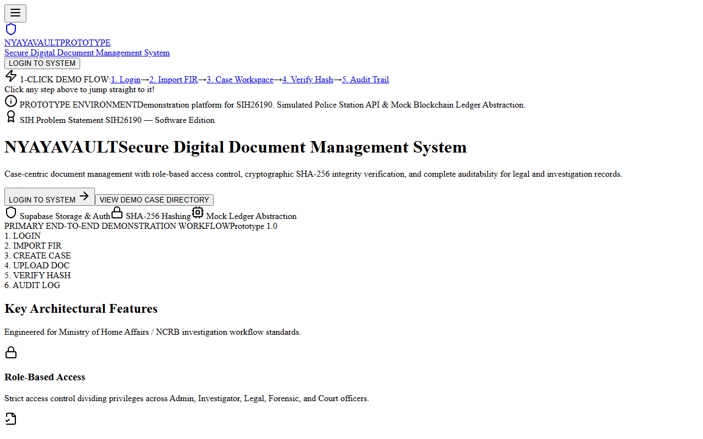

#### Purpose & Capabilities:
- Introduces NYAYAVAULT brand, SIH Problem Statement SIH26190 banner, and sponsoring organization (NCRB / Ministry of Home Affairs).
- Displays primary architectural pillars: Secure Access Control, Document Integrity, Case Management, and Immutable Audit Trail.
- Highlights the **Primary 6-Step End-to-End Workflow** (`LOGIN` $\rightarrow$ `IMPORT FIR` $\rightarrow$ `CREATE CASE` $\rightarrow$ `UPLOAD DOC` $\rightarrow$ `VERIFY HASH` $\rightarrow$ `AUDIT LOG`).
- Provides 1-click launch buttons for all 5 role workspaces.

---

### 2. Login Portal & 1-Click Role Switcher (`/login`)

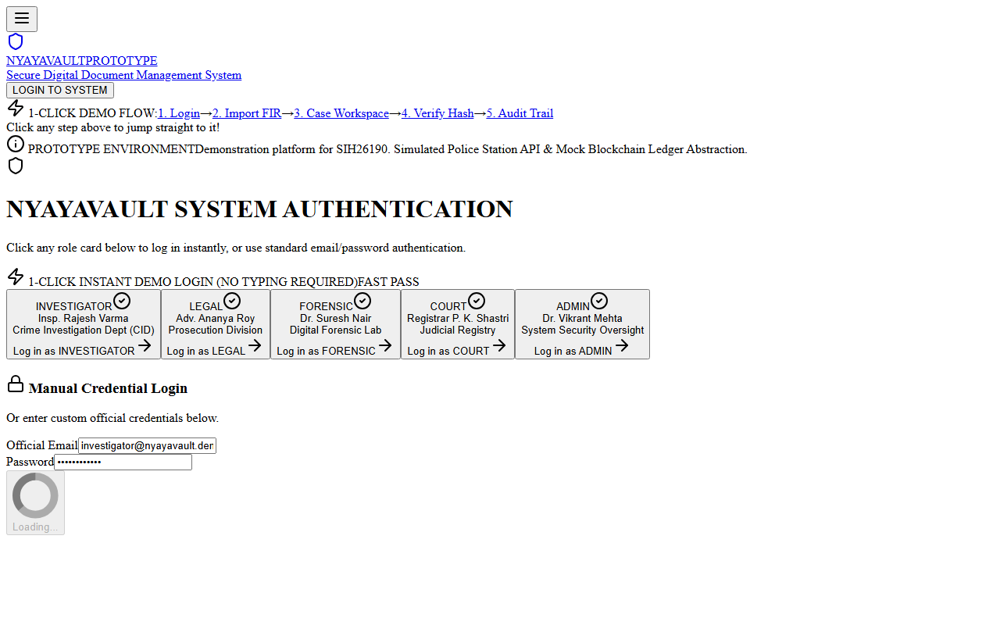

#### Purpose & Capabilities:
- Authenticates users via Supabase Auth and manages session persistence.
- Features **1-Click Instant Demo Login Cards** for extreme simplicity—clicking any role card (`Insp. Rajesh Varma`, `Adv. Ananya Roy`, `Dr. Suresh Nair`, `Registrar P. K. Shastri`, `Dr. Vikrant Mehta`) logs in immediately without typing.
- Includes standard manual email/password fallback login form.

---

### 3. Investigator Workspace Dashboard (`/investigator`)

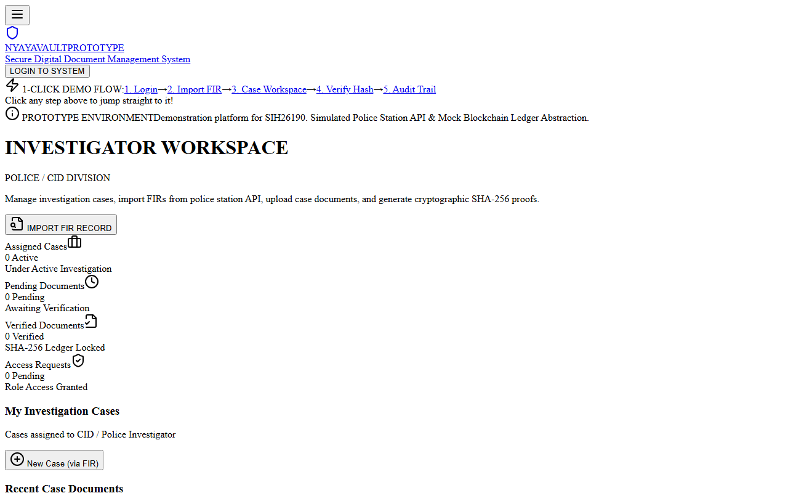

#### Purpose & Capabilities:
- Dedicated operational workspace for Police and CID Officers.
- **Metric Cards**: Real-time counts for Assigned Cases, Pending Reviews, Verified Documents, and Access Requests.
- **My Investigation Cases**: Summarizes active cases with FIR references, police station jurisdictions, and case status tags.
- **Recent Documents & Audit Stream**: Displays recently uploaded case files and live security events.
- **Action Triggers**: Prominent button to launch simulated FIR import.

---

### 4. Police Station FIR Import Integration (`/investigator/fir`)

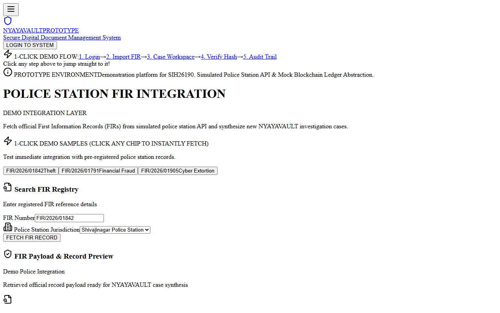

#### Purpose & Capabilities:
- Demonstrates integration layer fetching First Information Reports from police station databases.
- Includes **1-Click Sample Chips** (`FIR/2026/01842`, `FIR/2026/01791`, `FIR/2026/01905`) that automatically populate and fetch records in 1 tap.
- Multi-step loading state (*"Connecting to Police Station Integration Layer..."* $\rightarrow$ *"FIR Retrieved Successfully"*).
- **"IMPORT INTO NYAYAVAULT"** button automatically creates a database case record, writes the FIR record, logs security telemetry, and redirects to the new case workspace.

---

### 5. Central Case Workspace (`/cases/[id]`)

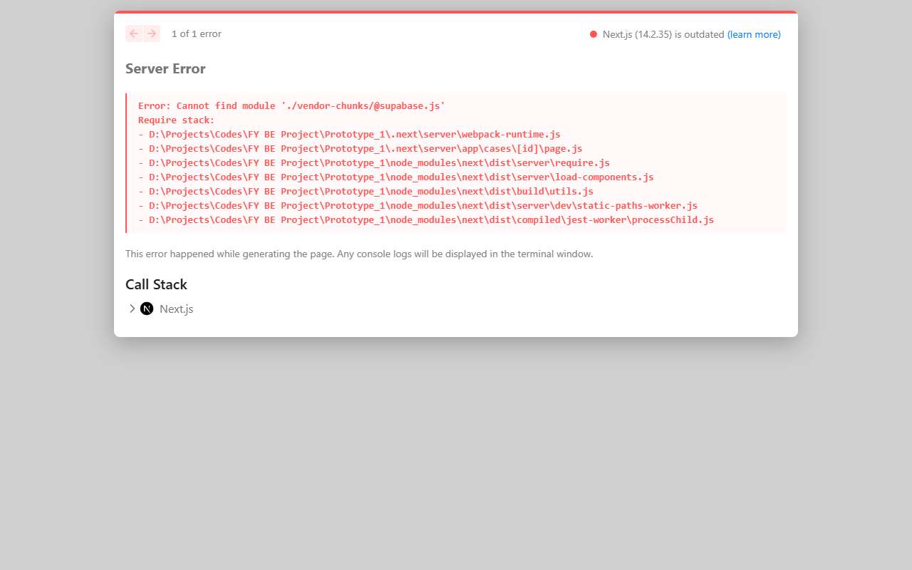

#### Purpose & Capabilities:
- Synthesizes all case-level metadata: Case Number, FIR Reference, Police Station Jurisdiction, Assigned Officer, and Creation Date.
- **Case Document Registry**: Categorizes uploaded FIRs, investigation reports, forensic analysis, charge sheets, and evidence records with live SHA-256 hash badges.
- **Document Upload Modal**: Features a **`⚡ Add Sample PDF`** button that auto-generates a sample PDF file in 1 click, computes its SHA-256 hash live in the browser, uploads to Supabase Storage, and commits proof to the mock ledger.
- **Case Audit Sidebar**: Displays chronological security events tied specifically to this investigation.

---

### 6. Cryptographic Document Integrity Verification (`/documents/[id]/verify`)

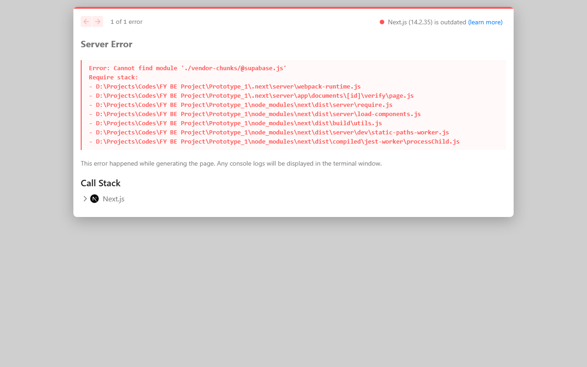

#### Purpose & Capabilities:
- Provides independent cryptographic verification for any stored document.
- Calculates current file hash via Web Crypto API and compares against registered `documents.sha256` and mock ledger transaction ID.
- **SUCCESS UI**: Prominent green banner (`DOCUMENT VERIFIED — ✓ SHA-256 MATCH`, `✓ INTEGRITY RECORD FOUND`, `✓ VERSION VERIFIED`).
- **Tamper Simulation Mode**: Interactive button **"Simulate 1-Bit File Alteration"** alters 1 character of the hash digest to demonstrate instant red **"DOCUMENT INTEGRITY FAILED"** alert.

---

### 7. System Audit Trail (`/audit`)

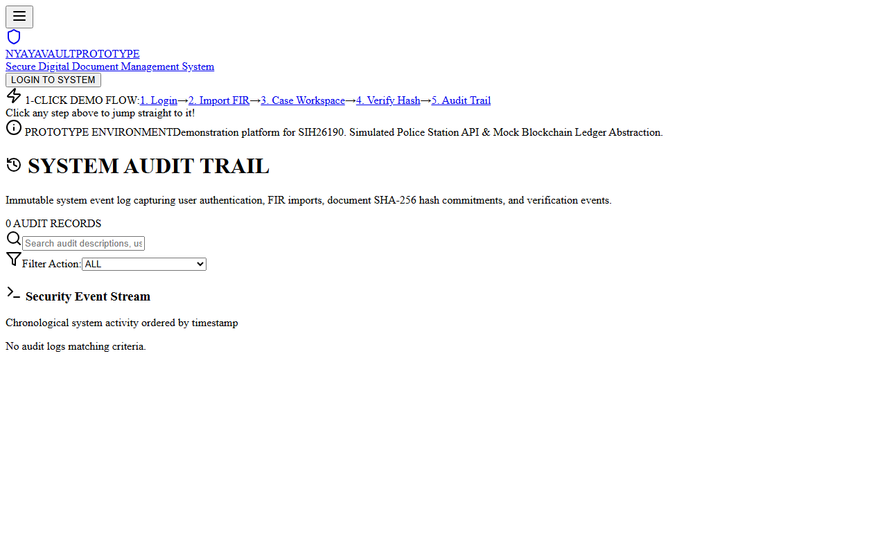

#### Purpose & Capabilities:
- Centralized security event stream recording all system actions.
- **Filters**: Filterable by Action (`LOGIN`, `LOGOUT`, `FIR_FETCHED`, `FIR_IMPORTED`, `CASE_CREATED`, `DOCUMENT_UPLOADED`, `HASH_GENERATED`, `INTEGRITY_RECORDED`, `DOCUMENT_VERIFIED`), User ID, Case ID, and Search Query.
- Displays timestamp, actor profile, target case/doc, action badge, description, and expandable JSON metadata payload.

---

### 8. Legal Prosecution Workspace (`/legal`)

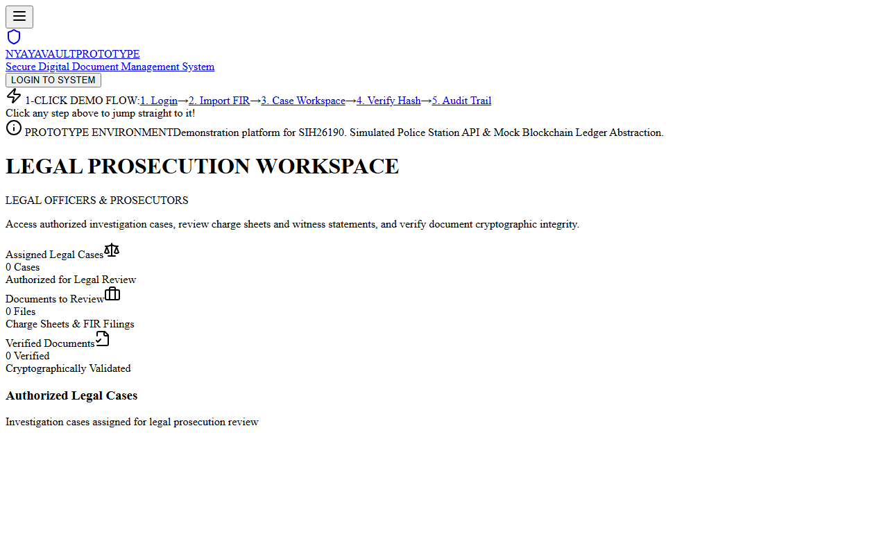

#### Purpose & Capabilities:
- Dedicated workspace for Public Prosecutors and Legal Officers.
- Displays authorized investigation cases assigned for legal prosecution review.
- Allows legal teams to inspect charge sheets, witness statements, and verify cryptographic evidence integrity prior to court submission.

---

### 9. State Digital Forensic Laboratory Workspace (`/forensic`)

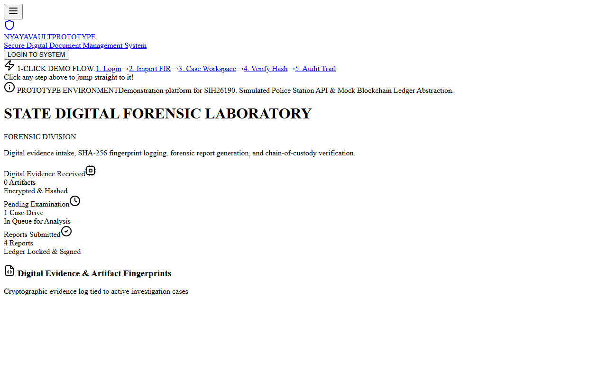

#### Purpose & Capabilities:
- Dedicated workspace for Forensic Examiners and Lab Analysts.
- **Digital Evidence Intake**: Displays digital artifact fingerprints, encrypted drive dumps, and forensic analysis reports.
- Maintains chain-of-custody logging and cryptographic fingerprint verification.

---

### 10. District & Sessions Judicial Court Workspace (`/court`)

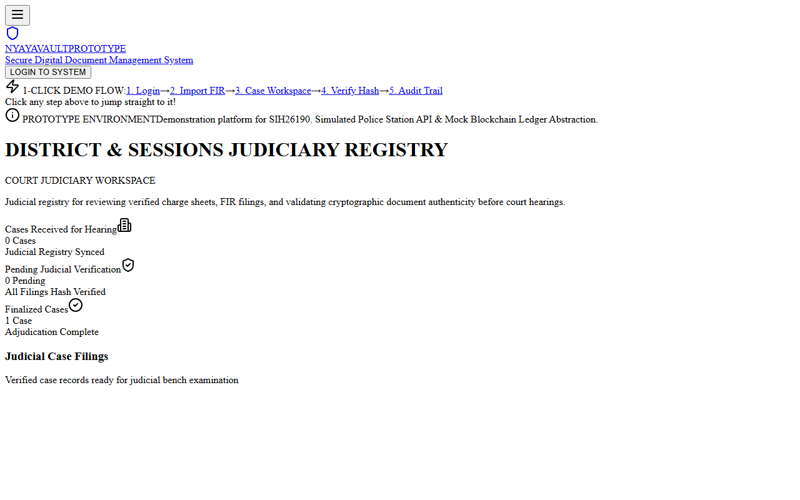

#### Purpose & Capabilities:
- Dedicated workspace for Judges, Judicial Registrars, and Bench Clerks.
- Displays court dockets, verified charge sheets, and trial hearing schedules.
- Ensures all submitted evidence records are cryptographically validated prior to judicial review.

---

### 11. System Security & Administration Workspace (`/admin`)

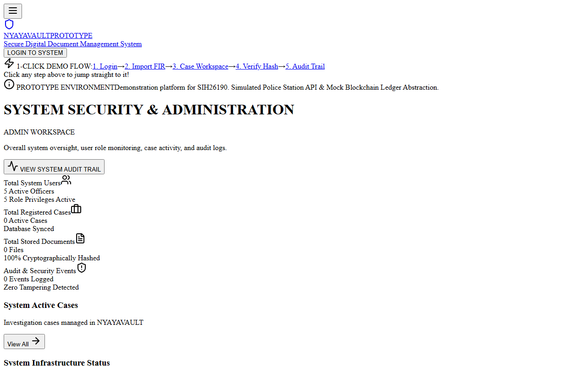

#### Purpose & Capabilities:
- Central command dashboard for System Security Administrators.
- **Metrics Grid**: Total System Users, Registered Cases, Stored Documents, and Security Audit Events.
- **Infrastructure Status**: Health indicators for Supabase Auth, Storage Engine, WebCrypto Hashing, and Mock Ledger Sync.

---

## ⚡ 1-Click Simplicity Features Summary

NYAYAVAULT is designed for instant evaluation with zero friction:

1. **Header Workflow Stepper**: Click any step (`1. Login` $\rightarrow$ `2. Import FIR` $\rightarrow$ `3. Case Workspace` $\rightarrow$ `4. Verify Hash` $\rightarrow$ `5. Audit Trail`) in the top navbar to jump straight to it.
2. **1-Click Instant Login**: Log in as any role with a single click.
3. **1-Click Sample FIR Chips**: Fetch FIR records instantly with 1 tap.
4. **1-Click Sample PDF Generator**: Create evidence PDF files on the fly without searching your local hard drive.
5. **1-Click Tamper Simulation**: Test tamper detection with 1 button toggle.

---

## 🚀 Running the Project Locally

```bash
# Install dependencies
npm install

# Start development server
npm run dev
```

Open `http://localhost:3000` in your browser.
